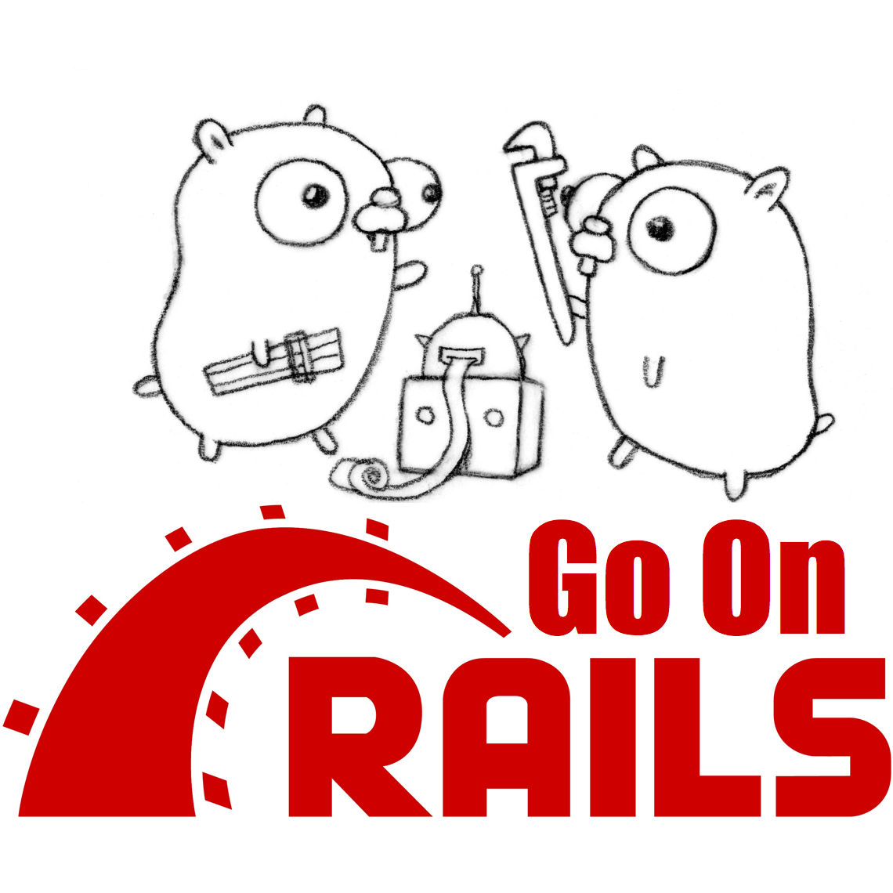

<p align="center">
  
</p>

[](https://badge.fury.io/rb/go-on-rails)
[](https://travis-ci.org/railstack/go-on-rails)
[](https://codeclimate.com/github/railstack/go-on-rails/maintainability)
[](https://github.com/railstack/go-on-rails/blob/master/MIT-LICENSE)


# Go on Rails

[用 Rails 开发 Go 应用：中文文档](./README_zh.md)

`go-on-rails` is a Rails generator aims to:

1. Help to develop and integrate some APIs written in Golang to existed Rails app for high performance
2. Use your farmiliar Rails tools to develop and manage a Golang app project
3. Convert a *not very complicated* Rails app to Golang equivalent

Here's some examples:
* A simple [example(tutorial)](https://github.com/railstack/example_simple) on the basic usage of go-on-rails generator
* [An advanced example](https://github.com/railstack/example_with_admin) shows how to integrate Go APIs in a Rails project
* [Another example](https://github.com/railstack/example_read_rails_session) shows how to handle a Rails session to get an user's info in a go-on-rails generated Go API

## Prerequisites

* Rails 4.2+
* Golang 1.7.x

## Installation

Add this line to your application's Gemfile:

```ruby
gem 'go-on-rails', '~> 0.3.1'
```

And then execute:
```bash
$ bundle
```

Or install it yourself as:
```bash
$ gem install go-on-rails
```
## Usage

You must have an existed Rails app or to create a new one before you try go-on-rails to generate Golang codes.

After that you can run the command just as other Rails generators:

```bash
rails g gor [dev(elopment) | pro(duction) | test | ...] [-m model_a model_b model_c ...]

# OR (on rails version < 5.0)
rake g gor ...
```

here we take generating all models for the `development` environment for example:

```bash
rails g gor dev
```

Then a folder named `go_app` that includes Golang codes will be generated under your Rails app root path.

Install the dependent Golang packages for this Go project:

```bash
rails gor:deps
```

Then change to the `go_app` directory and run:

```bash
go run main.go
```

You can visit the page in http://localhost:4000 by default.

More command details about go-on-rails generator:

```bash
rails g gor --help
```

## What will be generated?

* Go project directory layout (all under the `go_app` directory, like `views`, `controllers`, `public`)
* A Go data struct corresponding to each activerecord model
* And each struct related CRUD functions/methods like FindModel, UpdateModel, DestroyModle etc. All these models related program files under the `go_app/models` directory
* And godoc files for all the functions under `go_app/models/doc`
* We use [Gin](https://github.com/gin-gonic/gin) as the default web framework, but you can change it to anyone that you favor in `main.go` and `controllers` programs

### View the godoc of all functions

You can view the godoc page of all functions in http://localhost:7979/doc/models.html after run:

```bash
rails gor:doc
```

Besides, there's [a sample project](https://github.com/railstack/gor_models_sample) generated by go-on-rails, you can view its [godoc](https://godoc.org/github.com/railstack/gor_models_sample) at godoc.org just now to get a picture of what functions are generated.


## Known issues and TODOs

The gem is still under development, so there're some known issues. You're welcomed to contribute. 👏

* databases specific functions between MySQL and Postgres or other databases are not covered completely
* sql.NullType not supported yet, so you'd better in the migrations set those columns "not null" with a default value that's consistent with Golang's zero value specification, such as "" default for string and text typed column, and 0 default for int, etc. And now we have an alternative approch for manipulating the database nullable fields, see the wiki [Working with database nullable fields](https://github.com/railstack/go-on-rails/wiki/Working-with-database-nullable-fields)

- [x] Associations
  - [x] has_many
  - [x] has_one
  - [x] belongs_to
  - [x] dependent
- [x] Validations
  - [x] length
  - [x] presence
  - [x] format(string only)
  - [x] numericality(partially)
  - [ ] other validations
- [x] Pagination(details see [wiki](https://github.com/railstack/go-on-rails/wiki/Pagination))
- [ ] Callbacks
- [ ] Transactions

## Supported databases

* SQLite
* MySQL
* Postgres

## Wiki

* [Built-in Pagination](https://github.com/railstack/go-on-rails/wiki/Pagination)
* [Working with database nullable fields](https://github.com/railstack/go-on-rails/wiki/Working-with-database-nullable-fields)
* [Some Make commands](https://github.com/railstack/go-on-rails/wiki/Some-Make-commands)
* [Dockerize a Go-on-Rails application](https://github.com/railstack/go-on-rails/wiki/Dockerize-a-Go-on-Rails-application)

## Golang dependencies by default

* [github.com/jmoiron/sqlx](https://github.com/jmoiron/sqlx): an extension on the standard `database/sql` database API library
* [github.com/railstack/go-sqlite3](https://github.com/railstack/go-sqlite3): a SQLite driver(This's a forked version of [mattn/go-sqlite3](https://github.com/mattn/go-sqlite3), and This is [why we use this forked version](https://github.com/mattn/go-sqlite3/pull/468))
* [github.com/go-sql-driver/mysql](https://github.com/go-sql-driver/mysql): a MySQL driver
* [github.com/lib/pq](https://github.com/lib/pq): a PostgreSQL driver
* [github.com/asaskevich/govalidator](https://github.com/asaskevich/govalidator): for the struct validation
* [github.com/gin-gonic/gin](https://github.com/gin-gonic/gin): a HTTP web framework

## Acknowledgement

When I had the idea to convert Rails app or build Golang app with Rails tools, I searched github and found the project: https://github.com/t-k/ar2gostruct. And from ar2gostruct I copied some codes on handling data structure convertion and models association, it make my idea come true faster than I imagined.

## Contributing

There're two branches at present: `master` and `dev`.

The `dev` branch has a whole Rails environment for development: models, seeds for testing, and under `go_app` directory there's a file named `modles_test.go` used to test generated Golang codes.

- Fork the project switch to branch `dev`.
- Make your feature addition or bug fix.
- Add tests for it. This is important so I don't break it in a future version unintentionally.
- Commit, do not mess with Rakefile or version (if you want to have your own version, that is fine but bump version in a commit by itself I can ignore when I pull)
- Send me a pull request. Bonus points for topic branches.

### Testing

We create four models for testing:

- Physician
- Patient
- Appointment
- Picture

Run `rails db:seed` to use the data defined in `db/seeds.rb`. And change to `go_app/models` directory to run `go test` to test generated models-related functions. The test covers a small part of the functions currently. More will be added later on.

## License

See the [LICENSE](https://github.com/railstack/go-on-rails/blob/master/MIT-LICENSE) file.
